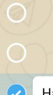
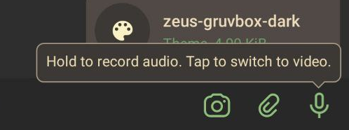

# Telegram X

### Accent

| notes         | most things one should need to change will be here. this section only serves as a shortcut to other sections |
| ------------- | ------------------------------------------------------------ |
| controlActive | also controls the colour of the theme preview in the theme selection menu (see [other\theme[Colour]](#other)) |

### Content

|      |      |
| ---- | ---- |
| separator | list view separating line |
| textSecure | secret chats name /?\ |
| textSearchQueryHighlight | section of text that matches query string when searching |

### Header
| notes | mostly to do with the top (coloured in the default themes) bar |
| ---- | ---- |
| headerIcon | icons in header - doesn't include all icons, may be a bug? some are just coloured white |
| headerTabActive                    | line underneath active tab                                   |
|  |  |
| headerButton[Icon]                 | floating action button (FAB) in expanded header (profile screen etc.) |
| headerRemoveBackground             | /?\                                                          |
|  |  |
| headerPlaceholder                  | /?\                                                          |
| statusBarContent                   | content generated by telegram in the statusbar. i.e. not the system icons, but the centred "connected" text etc. |
| profileSectionActive[Content] | active media tab [line below/text] in profile screen ("Photos", "Videos" etc.) |
| passcode | background of password/pin/pattern for entering the app |
| passcode[Icon/Text] | icons and text on password screen. results are inconsistent (e.g. dots are text colour when password, icon colour when pin) |
| notification[Player/Secure] | /?\ unknown? not header media player background. maybe calls? |

### Controls
|      |      |
| ---- | ---- |
| controlContent                     | "tick" icon inside control. this is consistent across all [xxx]Content items |
| textPlaceholder                    | prefilled dummy text inside underlined content fields        |
|  |  |
| inline[Outline/Text/Icon] | inline buttons in non-bubbles view (e.g. instant view, see [bubbles\inline[xxx]](#bubbles)) |
| inlineContentActive                | text inside inline buttons when pressed (e.g. instant view, see [bubbles\inline[xxx]](#bubbles)) |
|  |  |
| circleButtonRegular[Icon] | main chat list FAB. for inverted colours when tapped, see [other\circleButtonActive](#other) |
| circleButtonNew\[xxx][Icon] | popup buttons from circleButtonRegular |
| circleButtonOverlay[Icon] | used in emoji/gif keyboard as backspace/search button |
| circleButtonChat[Icon] | "jump to bottom" icon in chats. also "mute" fab in channels |
| circleButtonTheme[Icon] | floating theme button when minimised (⋮⇒minimise) |
|  |  |
| introSection[Active] | dots underneath app's splash screen when signing in /?\ |
|  |  |
| _Music Player_ |  |
| playerButtonActive                 | e.g. shuffle item when shuffle mode is enabled               |
| playerCover[Icon/Placeholder] | cover colours for music with no album art |

### Media

|  |      |
| ---- | ---- |
| avatar_content | icon inside avatar for contacts without profile picture |
| avatarArchive | archived chats avatar colour when pinned to top of list |
| avatarArchivePinned | archived chats avatar colour when hidden above chats list |
| avatarInactive | avatar colour of unavailable (e.g. deleted) accounts |
| avatar[Colour] | (randomised) avatar colour for contacts without profile picture |
| avatar[Colour]\_big | expanded avatar in profile view for contacts without profile picture |
| name[Colour] | /?\ |
| _Media_ |  |
| file               | play button for audio                                   |
| file[Colour]       | background of attached files in messages and file list. /¿\ also *may* be used for links with missing favicon /?\ |
| waveform[In]active | foreground/background of voice messages' waveform progressbar |
| _Attach Menu_ |  |
| attach[Type]                       | background of bottom sheet in attach (paperclip) menu        |
| attachText                         | text/icon of attach sheet bottom (opacity reduces when unfocussed) |
| fileAttach                         | file type (gallery, music, etc.) circular icon background in attachFile menu. icon is [service\white](#service) |

### Chats
| notes | mainly the chats list, but also some properties from chat with bubbles disabled |
| ---- | ---- |
| chatListAction | status indicator under the chat's contact name (e.g. "typing...") |
| chatListIcon | media type icon displayed before message preview |
| badgeFailed[Text] | message failed to send warning (i.e. no internet) /?\ |
| badgeMuted | unread badge for chats with muted notifications |
|  |  |
| chatKeyboard[Button] | /?\ |
|  |  |
| unread[Text] | "unread messages" banner, **only in no bubbles mode**,  (see [bubbles\unread[Text]](#bubbles)) |
| messageVerticalLine | used for replies, link previews, etc. (see [bubbles\chatVerticalLine](#bubbles)) |
| messageSelection | background of selected message, see [bubbles\messageSelection](#bubbles) (channels only by default) |
| messageSwipe[Background/Content] | swipe reply/forward bar **when bubbles disabled in chats** (similar to [bubbles\button[Ripple/Text]](#bubbles)) |
| messageAuthor[Psa] | author of reply quoted message /?\ |
| shareSeparator                     | line separating contacts grid from "open in" text (e.g. in IV sharesheet) |

### Bubbles
| notes | many properties are prefixed with `bubbleIn_`, `bubbleOut_`, or `bubble_` |
| ---- | ---- |
| bubble_messageSelection | selection colour behind message, **only in bubbles mode** (see [chats\messageSelection](#chats)) |
| bubble_messageSelectionNoWallpaper | colour of above, when chat wallpaper is disabled. this is consistent across all [xxx]NoWallpaper items /?\ |
| bubble_messageCheckOutline |  (the tick itself is influenced by [controls\checkActive](#controls) |
|  |  |
| **bubble[In/Out]_[xxx]** | **received/sent message bubbles** |
| time | sent time inside bubble |
| progress | /?\ |
| textLink | clickable url link |
| textLinkPressHighlight | background colour of links when tapped |
| messageAuthor[Psa] | /?\ see [chats\messageAuthor](#chats) |
| chatVerticalLine | reply quote line ++. see [chats\messageVerticalLine](#chats) |
| inline[Outline/Text/Icon] | inline button, e.g. instant view (see [controls\inlineContentActive](#controls)) /?\ [icon] may not work? |
| waveform[In]active | see [media\waveform[In]active](#media) |
| file | /?\ |
| outline | outline of message bubbles, disabled by default (bool bubbles\bubbleOutline) |
| pressed | /?\ |
| separator | /?\ |
|  |  |
| **bubble_[xxx]** | **the following values are prefixed with `bubble_`** |
| unread[Text]                | !["unread messages" banner [text]](imgs/x-new-msg.png "\"unread messages\" banner [text]")  (make sure to also change [chats\unread[Text]](#chats)) |
| date[Text]                  | ![floating date bubble [text].](imgs/x-date-bubble.png "floating date bubble [text].") also used for service message (e.g. "[contact] joined telegram") |
| button[Ripple/Text] | button beside messages when swiping (e.g. reply). /?\ ripple unknown |
| mediaReply[Text] | /?\ |
| mediaOverlay[Text] | time/ticks overlay indicator on media (photo etc.) messages |
| overlay[Text] | /?\ |

### Instant View

| notes                         | most items are prefixed with `iv_`. many of these i'm unsure about. many are named after html tags |
| ----------------------------- | ------------------------------------------------------------ |
| pageTitle                     | title declared in `<head>`. used as h2 elements as well, maybe more |
| textMarked[Background]        | [`<mark>`](https://www.w3schools.com/tags/tag_mark.asp) tagged text/background /?\ |
| textMarkedLink[Background]    | url link inside `<mark>` tag /?\                             |
| textReference[xxx]            | /?\ [`<cite>`](https://developer.mozilla.org/en-US/docs/Web/HTML/Element/cite) maybe? background is strong by default though |
| textCode                      | `<code>` /?\                                                 |
| caption                       | image caption text. displayed under image                    |
| header                        | /?\ unused? see ivHeader and pageTitle                       |
| pullQuote                     | used for [`<aside>`](https://quinnlabs.com/articles/pullquotes-blockquotes-and-asides-in-html5/) tagged text. most websites use `<blockquote>` for a pullquote though |
| blockQuote[Line]              | `<blockquote>` quotes /?\                                    |
| [preBlock/textCode]Background | background of inline code, code blocks and ¿[`<pre>`](https://www.w3schools.com/tags/tag_pre.asp) tagged text?. usually behind dimmed monospace font |
| textCodeBackgroundPressed     | codeblocks allow one to easily copy a whole block–this is the background when tapped |
| separator                     | horizontal line. corresponds to [`
`](https://www.w3schools.com/tags/tag_hr.asp) element |
|                               |                                                              |
| ivHeaderIcon                  | applies to both text and icons in header. /!\ no underscore in prefix /!\ |
| ivHeader                      | page titlebar, similar to [header section](#header). /!\ no underscore in prefix /!\ |

### Other

| notes | there are many probably important undocumented colours at the bottom of this section |
| ---- | ---- |
| theme[Colour] | only previews of theme in settings menu. you shouldn't need to change these |
| wpCats[Colour] | /?\ probably unimportant |
| sectionedScrollBar[Active/Content] | /?\ i couldn't find any sections scrollbars in the app? |
|                                    |                                                              |
| snackbarUpdate[Action/Text] | /?\ presumably the [snackbar prompt](https://material.io/components/snackbars) to update? |
|  |  |
| _Unsorted_ | |
| tooltip\_[text/textLink/PressHighlight/outline] |  also used for other tooltips, e.g. quizzes |
| circleButtonActive[Icon] | when tapping the [chats list FAB](#controls), it opens a list of sub-FABs and changes to these colours |
| notificationLink | /?\ link colour in notifications?? |
| **message[xxx]** | **poll/quiz colours in non bubble mode** |
| NeutralFillingContent | icon of poll answers /!\ colour source may be inlineOutline? |
| CorrectFilling[Content] | quiz correct answer responses line |
| CorrectChosenFilling[Content] | quiz correct answer line when user chose correctly |
| NegativeFilling[Content] | quiz incorrect answer line |
|  |  |
| confetti[Colour] | confetti burst when getting a quiz answer correct |
|  |  |
| **bubbleOut_chat[xxx]:** | **poll/quiz colours in bubble mode** |
| NeutralFillingContent | icon of poll answers /!\ colour source may be inlineOutline? |
| CorrectFilling[Content] | quiz correct answer responses line |
| CorrectChosenFilling[Content] | quiz correct answer line when user chose correctly |
| NegativeFilling[Content] | quiz incorrect answer line |
| iv_icon | /?\ unknown, presumably instant view related |
| iv_chatLink[Overlay]Background | /?\ unknown, presumably instant view related |

### Service
|      |      |
| ---- | ---- |
| caption_textLink[PressHighlight]   | /?\ maybe should be link when viewing an image, but doesn't seem to apply |
| videoSlider[In]active              | progress bar (scrubber) [foreground/background] of video players |
| white                              | an annoyingly generic property, covering (buggy?) expanded header icon buttons, name in sidebar, text at the top of images, shutter icon for camera, and more… |
| black                              | /?\ unknown, but is the background of "caption\_" colours in settings. maybe also accessibility? |
| transparentEditor                  | background of caption text over images, image editor. must be transparent as it covers some of the image when editing |
|                                    |                                                              |
| photoHighlightTint[№] | /?\ |
| led[Colour]                        | radio button for choosing led colour in settings [ztodo: does this affect actual led colour?] |